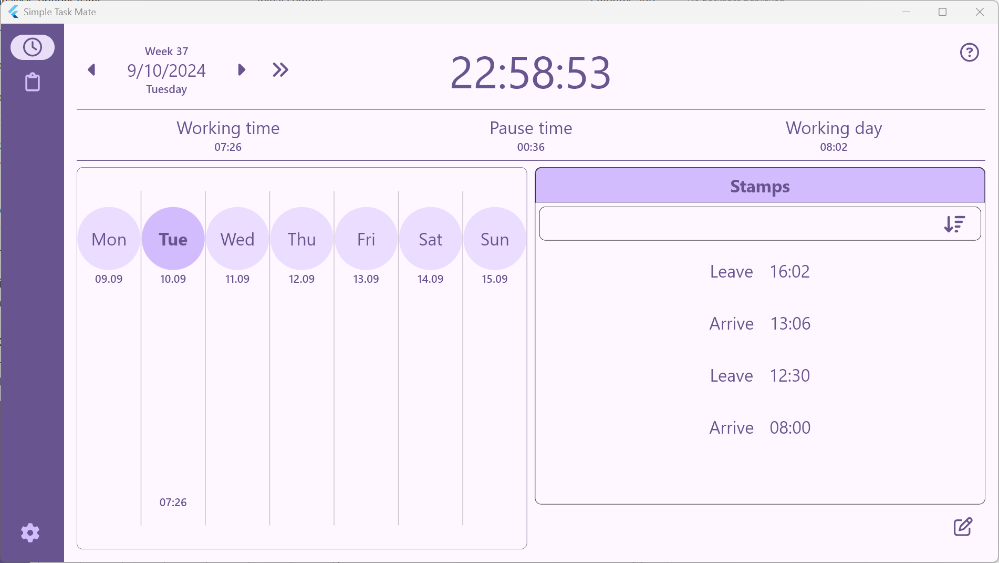
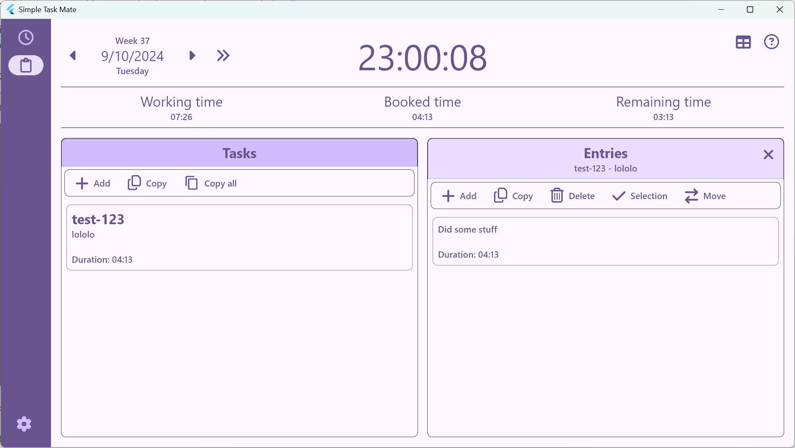

# Simple Task Mate

Simple Task Mate enables you to book times and manage tasks locally.

It is build with [Flutter](https://flutter.dev/). Current target platform is Windows.\
The app is lightweight, the main data is managed in a local SQLite data base file.

### Stamp view

Book your times and have all relevant information in sight.

### Task view

Manage your tasks and record the corresponding durations.

## FAQ
- Where is the application data stored? \
The config and data base file are by default saved in _%appdata%\ozml\SimpleTaskMate_. \
Only the location of the data base file can be changed.
